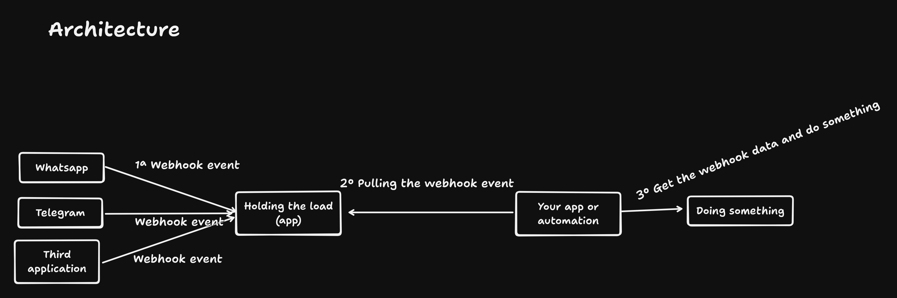

# Holding The Load 🚀

A Cloudflare-based solution to handle high loads and queue requests efficiently.

## Table of Contents 📋

- [About](#about-)
- [When to Use It](#when-to-use-it-)
- [Features](#features-)
- [Cost Simulation](#cost-simulation-)
- [Technologies](#technologies-)
- [How to Run](#how-to-run-)
- [Environment Variables](#environment-variables-)
- [Free Tier Limitations](#free-tier-limitations-)
- [Architecture](#architecture)
- [Load Tests](#load-tests)
- [Support](#support)

## About 📖

This project leverages Cloudflare infrastructure (Workers + Durable Objects with SQLite storage) to manage load spikes effectively. You can pull requests one by one or in batches (e.g., 10 at a time).

## When to Use It 💡

Imagine running automation on N8N in a VPS (a rented computer) that's not powerful enough—powerful computers are expensive. As your AI chatbot or app gains popularity, it starts receiving many requests throughout the day, overwhelming the VPS. You need to upgrade the VPS, which costs more, and if demand grows again, you upgrade again, getting more expensive each time.

How can you solve this?

This is the motivation behind **Holding The Load**: Cloudflare handles spikes and unexpected demand, while you pull requests at your own pace based on your VPS resources.

## Features ✨

- **Queue Management**: Efficiently queue incoming requests during high load.
- **Batch Processing**: Pull requests individually or in batches.
- **Group id**: seperate the webhooks based application or automation. Ps: to add your own Group ids open the file **groups.json** on root of project.
- **Scalable Storage**: Uses Durable Objects with SQLite for reliable data persistence.
- **Cost-Effective**: Low-cost solution for handling traffic spikes.
- **Idempotency id**: Mechanism to avoid duplicated webhook requests.
- **the request body validation**: Validate the incoming webhook requests based on group id.

### Features details

#### How to setup a new Group id

- Access the file ./groups.json
- Add a new value on the list. PS: no use special characters, for example: queue_user, queue_product, queue_chatbot_customer_1 and etc.

#### How to setup the request body validation

- Copy the JSON structure you are expecting
- Access the website https://transform.tools/json-to-zod
- On JSON section paste the json
- For example:

```json
{
	"userId": 1,
	"id": 1,
	"title": "delectus aut autem",
	"completed": false
}
```

- The website will generate the Zod schema something like that:

```js
import { z } from 'zod';

export const schema = z.object({
	userId: z.number(),
	id: z.number(),
	title: z.string(),
	completed: z.boolean(),
});
```

- Copy the following part:

```js
z.object({
	userId: z.number(),
	id: z.number(),
	title: z.string(),
	completed: z.boolean(),
});
```

- Access the file src/schemas-validation.ts
- Add a group id as **key** and as value paste the value copied. Example:

```json
const SCHEMAS_VALIDATIONS: { [key: string]: z.Schema } = {
	group_id_value_here: z.object({
		userId: z.number(),
		id: z.number(),
		title: z.string(),
		completed: z.boolean()
	}),
};
```

- When you receive a webhook on route /new-events?groupId=group_id_value_here will automatically identify if has validation to apply for the group id, case yes, apply the validation.

## Cost Simulation 💰

**Scenario:** 10 million requests per month, 7ms CPU time using Cloudflare Workers and Durable Objects with SQLite storage.

### Cost Breakdown

| Component                             | Usage Details                                          | Monthly Cost |
| ------------------------------------- | ------------------------------------------------------ | ------------ |
| Base Subscription (Workers Paid Plan) | -                                                      | $5.00        |
| Worker Requests                       | 10M total (included in plan)                           | $0.00        |
| CPU Time                              | 70M ms total (30M included; 40M overage @ $0.02/1M ms) | $0.80        |
| DO Requests                           | 10M total (@ $0.15/1M requests)                        | $0.50        |
| DO SQL Writes                         | 500k total (included in plan)                          | $0.00        |
| DO SQL Reads                          | Dependent on logic (included in plan)                  | $0.00        |
| **Total Estimated**                   |                                                        | **$6.30**    |

## Technologies 🛠️

- Cloudflare Workers
- Durable Objects (SQLite storage)
- Node.js (v21.0.0)
- TypeScript

## How to Run 🏃‍♂️

1. Clone the project
2. Set up the `API_KEY` in `wrangler.jsonc`
3. Run `npm run dev` to run locally
4. Run `npm run deploy` to deploy to Cloudflare (requires Wrangler CLI installed)
5. You can import **Insomnia_2026-01-12.yaml** file on Insominia to test the routes
6. Schedule request each 1 minute to call the route /health, so that way you make sure has a alarm to save data from memory to database.

## Environment Variables 🔧

- `API_KEY`: Protects the application and ensures only authorized applications can make requests

## Free Tier Limitations ⚠️

The free tier has limitations:

- 100,000 requests per day
- 128MB Durable Object memory limit
- 1,000 requests per minute
- 100,000 writes per day to Durable Object SQLite storage

### Need More Than the Free Tier?

Upgrade to the $5 plan. Learn more: [Cloudflare Workers Pricing](https://developers.cloudflare.com/workers/platform/pricing/)

## Architecture



## Example how to receive and consume the Webhooks

### Webhook request received

```
Request:
curl --request POST \
  --url http://localhost:8787/new-events \
  --header 'Content-Type: application/json' \
  --header 'User-Agent: insomnia/11.0.2' \
  --header 'x-api-key: api_key_here' \
  --data '{
	"message": "Hi 80e58d1f-067d-4d82-b064-54ea736d3a3b",
	"timestamp": "1751872147530"
}'

Response:
{
	"ok": true
}
```

### Get the webhook request received

```
Request:
curl --request GET \
  --url 'http://localhost:8787/pull-events?total=1' \
  --header 'Content-Type: application/json' \
  --header 'User-Agent: insomnia/11.0.2' \
  --header 'x-api-key: api_key_value'

Response:
[
	{
		"id": "f2d56c90-0fd0-4137-8b09-b5fb391a6685",
		"requestBody": {
			"message": "Hi d84af276-5e64-4a7b-a67a-0acb93fbfe21",
			"timestamp": "1793123847723"
		},
		"retries": 0
	}
]

Response(when doens't have webhook to process)
[]
```

## Load Tests 🧪

This section demonstrates how to simulate a spike and shows the simulation results. The simulation involves 5000 requests executed by 600 concurrent fake users using the autocannon library.

### Results with `ENABLE_SAVE_MANY_ONE_ROW` Disabled

```
┌─────────┬────────┬────────┬─────────┬─────────┬───────────┬───────────┬─────────┐
│ Stat    │ 2.5%   │ 50%    │ 97.5%   │ 99%     │ Avg       │ Stdev     │ Max     │
├─────────┼────────┼─────────┼─────────┼─────────┼───────────┼───────────┼─────────┤
│ Latency │ 153 ms │ 216 ms │ 1921 ms │ 1981 ms │ 427.63 ms │ 484.17 ms │ 2050 ms │
└─────────┴────────┴────────┴─────────┴─────────┴───────────┴───────────┴─────────┘
┌───────────┬─────┬──────┬────────┬─────────┬────────┬────────┬────────┐
│ Stat      │ 1%  │ 2.5% │ 50%    │ 97.5%   │ Avg    │ Stdev  │ Min    │
├───────────┼─────┼──────┼────────┼─────────┼────────┼────────┼────────┤
│ Req/Sec   │ 0   │ 0    │ 850    │ 2,405   │ 1,250  │ 908.51 │ 850    │
├───────────┼─────┼──────┼────────┼─────────┼────────┼────────┼────────┤
│ Bytes/Sec │ 0 B │ 0 B  │ 523 kB │ 1.48 MB │ 769 kB │ 559 kB │ 523 kB │
└───────────┴─────┴──────┴────────┴─────────┴────────┴────────┴────────┘
```

### Results with `ENABLE_SAVE_MANY_ONE_ROW` Enabled

```
┌─────────┬────────┬────────┬─────────┬─────────┬───────────┬──────────┬─────────┐
│ Stat    │ 2.5%   │ 50%    │ 97.5%   │ 99%     │ Avg       │ Stdev    │ Max     │
├─────────┼────────┼─────────┼─────────┼─────────┼───────────┼──────────┼─────────┤
│ Latency │ 150 ms │ 214 ms │ 1941 ms │ 2002 ms │ 434.97 ms │ 497.2 ms │ 2345 ms │
└─────────┴────────┴────────┴─────────┴─────────┴───────────┴──────────┴─────────┘
┌───────────┬─────┬──────┬────────┬─────────┬────────┬────────┬────────┐
│ Stat      │ 1%  │ 2.5% │ 50%    │ 97.5%   │ Avg    │ Stdev  │ Min    │
├───────────┼─────┼──────┼────────┼─────────┼────────┼────────┼────────┤
│ Req/Sec   │ 0   │ 0    │ 821    │ 2,307   │ 1,250  │ 901.49 │ 821    │
├───────────┼─────┼──────┼────────┼─────────┼────────┼────────┼────────┤
│ Bytes/Sec │ 0 B │ 0 B  │ 505 kB │ 1.42 MB │ 769 kB │ 555 kB │ 505 kB │
└───────────┴─────┴──────┴────────┴─────────┴────────┴────────┴────────┘
```

## Support 🤝

Need help setting up? Or struggling with a problem on your micro-SaaS or SaaS?

Contact me via email: [tiagorosadacost@gmail.com](mailto:tiagorosadacost@gmail.com)
